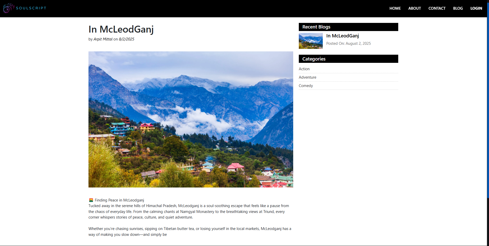
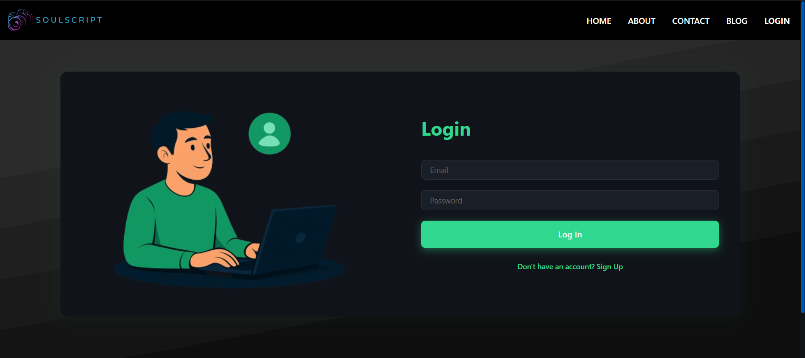

# SoulScript – A Reflective Blogging Platform 📝

Welcome to **SoulScript**, a storytelling and reflection platform where users can share thoughts, experiences, and personal insights. Built using the **MERN stack (MongoDB, Express.js, Node.js, EJS)**, it provides a minimal, responsive, and creative environment for self-expression.

## 🌐 Live Demo
**Render Deployment**: [Visit App](https://blog-project-nmnt.onrender.com/)  
(Note: First load might be slow due to free tier cold starts on Render.)

---

## 📂 Project Structure
SoulScript/
│
├── routes/ # Express route handlers
├── models/ # Mongoose models
├── public/ # Static files (CSS, images, JS)
├── views/ # EJS templates
├── .env # Environment variables
├── app.js # Main Express server
├── package.json
└── README.md


---

## 🚀 Features

- ✍️ Add, edit, delete blog posts
- 🔐 User login/logout with session support
- 📄 Clean, mobile-first EJS templates
- 🌈 Responsive layout with Bootstrap
- 🌍 MongoDB for persistent storage
- ❌ Custom error Messages
- 🖼️ Favicon and public assets support

---

## 🔧 Tech Stack

- **Frontend**: EJS, Bootstrap 5
- **Backend**: Node.js, Express.js
- **Database**: MongoDB Atlas
- **Hosting**: Render

---

## 📦 Installation (Local Setup)

```bash
git clone https://github.com/yourusername/soulscript.git
cd soulscript
npm install

---

🛠️ Setup .env file
Create a .env file with the following:
PORT=9000
MONGODB_LIVE=your_mongodb_connection_string
JWT_SECRET=your_session_secret
CLOUDINARY_CLOUD_NAME=your_cloudinary_cloud_name
CLOUDINARY_API_KEY=your_cloudinary_cloud_api_key
CLOUDINARY_API_SECRET=your_cloudinary_cloud_api_secret

---

▶️ Run Locally
npm start

Visit: http://localhost:9000

⚙️ Deployment Notes (Render)
✅ Render Setup Instructions
1. Choose "Web Service"
2. Build Command: npm install
3. Start Command: node app.js
4. Set environment variables in the dashboard:
  - PORT
  - MONGODB_LIVE
  - JWT_SECRET
  - CLOUDINARY_CLOUD_NAME
  - CLOUDINARY_API_KEY
  - CLOUDINARY_API_SECRET

⚠️ Common Issues
• Favicon not loading ➜ Check public/favicon.ico path and correct <link> in layout

🖼️ Screenshots
📌 Homepage


📌 Blog-details Page


📌 Login Page



🤝 Contributing
Feel free to fork and contribute!
Open an issue for any bug or suggestion.

📄 License
This project is licensed under the MIT License - feel free to use and modify it for personal or academic purposes.

👨‍💻 Author
Arpit Mittal
📧 Email: arpitmittal597@gmail.com
🔗 LinkedIn: https://www.linkedin.com/in/arpit-597-mittal/

---

